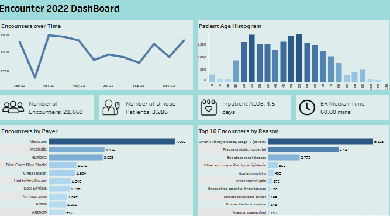

# Healthcare Operations & Patient Analytics: Inpatient, ER Throughput, & Payer Analytics

**Author:** Esha Bajaj  
**Repository:** [Healthcare-Operations-Patient-Analytics](https://github.com/EshaBajaj/-Healthcare-Operations-Patient-Analytics.git)  
**Tech Stack:** SQL (Microsoft SQL Server / T-SQL), Tableau Desktop, Synthea Synthetic EHR Dataset, Data Storytelling & Visual Analytics  

---

## 📌 Executive Summary & Strategic Rationale (The "WHY")

Modern healthcare operations sit at the intersection of clinical excellence, capacity constraints, and financial sustainability. Healthcare executives, clinical operations leads, and revenue cycle managers constantly face critical strategic challenges:

1. **Emergency Department (ED) Overcrowding & Bottlenecks:** Long ED wait times lead to increased Left Without Being Seen (LWBS) rates, elevated clinical risk, and patient dissatisfaction.
2. **Inpatient Capacity & Length of Stay (ALOS):** Unnecessary inpatient days inflate operational overhead, limit bed turnover for acute transfers, and incur Medicare readmission penalties.
3. **Payer Reimbursement Efficiency & Uncompensated Care:** Discrepancies between total claim costs and actual payer coverage impact cash flow and operating margins.
4. **Chronic Disease Management & Preventive Care:** Failing to proactively monitor high-risk cohorts (e.g., uncontrolled hypertension or Chronic Kidney Disease) leads to preventable, high-cost emergency encounters.

### 🎯 Strategic Objectives & Analytical Focus
This project transforms raw electronic health record (EHR) data into actionable executive insights to address core healthcare delivery challenges:
- **Volume & Demographic Profiling:** Evaluating patient volume distribution across care settings (Inpatient, Ambulatory, Emergency) to optimize clinical staffing and facility allocation.
- **ER Throughput Optimization:** Diagnosing bottleneck conditions (identifying cases with average throughput >100 minutes) and analyzing referral pathways to streamline emergency triage.
- **Financial & Reimbursement Ratios:** Measuring claim coverage percentages across Medicare, Medicaid, and private payers to safeguard hospital operating margins.
- **Preventive Surveillance:** Tracking hypertension control thresholds (140/90 vs. 135/85) and monitoring community vaccination coverage (Flu & COVID-19).

---

## 📊 Tableau Executive Dashboards

### 1. Inpatient & Clinical Encounter Overview Dashboard


#### Key Analytical Findings & Clinical Value:
- **Total Volume & Patient Reach:** Analyzed **21,669 total encounters** across **3,286 unique patients**, indicating high care intensity per patient.
- **Inpatient Average Length of Stay (ALOS):** Benchmark inpatient ALOS stands at **4.5 days**, identifying a key target for discharge planning optimization to improve bed turnover.
- **Primary Clinical Encounter Drivers:** **Chronic Kidney Disease, Stage IV (severe)** is the single largest encounter driver (**5,123 encounters**), followed by incidental pregnancy states (**6,147**) and End Stage Renal Disease (**2,772**).
- **Payer Mix Distribution:** **Medicare** represents the highest encounter volume (**7,006 encounters**), followed by **Medicaid** (**5,125**) and **Humana** (**5,025**), highlighting a heavily government-reliant revenue mix.

---

### 2. Emergency Room Visits & Throughput Dashboard


#### Key Analytical Findings & Operational Efficiency:
- **Emergency Department Volume:** Logged **9,216 ED visits**, serving as a critical entry point for hospital admissions.
- **Triage Median Wait Time:** Median ER wait time is maintained at **60.00 minutes**.
- **Temporal Heatmap Analysis:** Peak arrival times concentrate during weekday mid-mornings (8 AM – 11 AM) and Sunday evenings, establishing clear staffing target windows.
- **Department Referral Pathways:** **General Practice** is the primary referral source (**1,940 referrals**), followed by **Orthopedics** (**996 referrals**), pointing to strong primary care integration opportunities.

---

### 3. Outpatient Operations & Preventive Immunity Dashboard


#### Key Analytical Findings & Financial Metrics:
- **Outpatient Cost vs. Claim Coverage:** Mapped outpatient encounter costs against base costs to pinpoint negative-margin procedures.
- **Preventive Immunization Rate:** Achieved a **79% COVID-19 & Flu vaccination rate** across active hospital patient cohorts, supporting population health quality targets.

---

## 💻 SQL Analytical Engineering Framework

The analytical foundation is built using T-SQL queries designed to answer targeted business and operational questions:

### 1. Patient Demographics & Geographic Density
```sql
-- Strategic Question: What is our patient mix by gender, race, and ethnicity?
SELECT GENDER, RACE, ETHNICITY, COUNT(*) AS NUM
FROM [Healthcare].[dbo].[patients]
GROUP BY GENDER, RACE, ETHNICITY
ORDER BY NUM DESC;
```

### 2. Emergency Room Bottleneck & Throughput Query
```sql
-- Strategic Question: What is the average ER throughput (in minutes) per condition, and which exceed 100 minutes?
SELECT DESCRIPTION, AVG(THROUGHPUT_IN_MIN) AS THR_AVG
FROM (
    SELECT E.ID, C.DESCRIPTION, DATEDIFF(MINUTE, E.START, E.STOP) AS THROUGHPUT_IN_MIN
    FROM [Healthcare].[dbo].[encounters] E
    LEFT JOIN [Healthcare].[dbo].[conditions] C ON E.ID = C.ENCOUNTER
    WHERE E.START >= '2019-01-01' AND E.START < '2020-01-01' AND ENCOUNTERCLASS = 'emergency'
) T
GROUP BY DESCRIPTION
HAVING AVG(THROUGHPUT_IN_MIN) > 100
ORDER BY THR_AVG DESC;
```

### 3. Payer Claim Coverage Ratios
```sql
-- Strategic Question: Which payer had the highest claim coverage percentage for ambulatory encounters before 2020?
SELECT E.PAYER, P.NAME, 
       SUM(PAYER_COVERAGE)/SUM(TOTAL_CLAIM_COST) AS COVER_PERC_FOR_2019
FROM [Healthcare].[dbo].[encounters] E
JOIN [Healthcare].[dbo].[payers] P ON E.PAYER = P.ID
WHERE START < '2020-01-01' AND ENCOUNTERCLASS = 'ambulatory'
GROUP BY E.PAYER, P.NAME
ORDER BY COVER_PERC_FOR_2019 DESC;
```

### 4. High-Risk Uncontrolled Hypertension Identification
```sql
-- Strategic Question: How many patients had documented uncontrolled hypertension (>140/90) in 2018-2019?
SELECT DISTINCT PATIENT
FROM [Healthcare].[dbo].[observations]
WHERE ((DESCRIPTION = 'Diastolic Blood Pressure' AND VALUE > 90) 
    OR (DESCRIPTION = 'Systolic Blood Pressure' AND VALUE > 140))
  AND DATE >= '2018-01-01' AND DATE < '2020-01-01';
```

### 5. Active Patient Cohort Flu Vaccination CTE Query
```sql
-- Strategic Question: Which active, living patients received their 2019 flu vaccination?
WITH active_patients AS (
    SELECT DISTINCT E.PATIENT
    FROM [Healthcare].[dbo].[encounters] E
    JOIN [Healthcare].[dbo].[patients] PA ON E.PATIENT = PA.Id
    WHERE START >= '2019-01-01' AND STOP < '2020-01-01'
      AND PA.DEATHDATE IS NULL
      AND DATEDIFF(MONTH, PA.BIRTHDATE, GETDATE()) >= 6
),
flu_shot_2019 AS (
    SELECT PATIENT, SUBSTRING(MIN(DATE), 1, 10) AS EARLIEST_FLU_2019
    FROM [Healthcare].[dbo].[immunizations]
    WHERE CODE = 140 AND DATE >= '2019-01-01' AND DATE < '2020-01-01'
    GROUP BY PATIENT
)
SELECT PA.Id, PA.FIRST, PA.LAST, PA.RACE, PA.COUNTY,
       CASE WHEN FLU.PATIENT IS NULL THEN 0 ELSE 1 END AS GET_FLU_SHOT_2019
FROM [Healthcare].[dbo].[patients] PA
LEFT JOIN flu_shot_2019 FLU ON PA.Id = FLU.PATIENT
WHERE PA.Id IN (SELECT PATIENT FROM active_patients);
```

---

## 📈 Executive Action Plan & Strategic Recommendations

1. **Deploy Rapid Triage & Fast-Track ER Lanes:**
   - Establish fast-track protocols during identified peak bottleneck windows (8 AM – 11 AM weekdays) to divert non-emergent visits to outpatient/urgent care settings.
2. **Establish Chronic Kidney Disease (CKD) Outpatient Navigation Program:**
   - Given that Stage IV CKD is responsible for **5,123 encounters**, introducing proactive disease management and outpatient nephrology clinics will significantly reduce emergency readmissions.
3. **Optimize Commercial Payer Contracting:**
   - Re-evaluate contracts with commercial plans demonstrating low coverage percentages relative to total claim costs to minimize uncompensated care losses.

---

## 📁 Project Structure

```
├── Healthcare_Data_Analysis.sql       # Core T-SQL queries covering 6 analytical domains
├── Healthcare Demo Data.csv           # Cleaned patient encounter dataset
├── Hospital ER.csv                    # Emergency room visit logs
├── Flu Demo Data.csv                  # Immunization and flu shot logs
├── Flu shot 2019.xlsx                 # 2019 flu vaccination tracking workbook
├── images/                            # Dashboard screenshots
│   ├── encounter_2022_dashboard.png
│   ├── emergency_room_dashboard.png
│   └── outpatient_encounter_dashboard.png
└── README.md                          # Executive project documentation
```

---

## 🛠️ Quickstart & Local Setup

1. **Clone Repository:**
   ```bash
   git clone https://github.com/EshaBajaj/-Healthcare-Operations-Patient-Analytics.git
   cd -Healthcare-Operations-Patient-Analytics
   ```
2. **Database Setup:**
   - Import CSV files into Microsoft SQL Server or PostgreSQL.
   - Execute queries from `Healthcare_Data_Analysis.sql`.
3. **Tableau Visualizations:**
   - Open Tableau Desktop and connect to `Healthcare Demo Data.csv` and `Hospital ER.csv` to explore interactive dashboards

